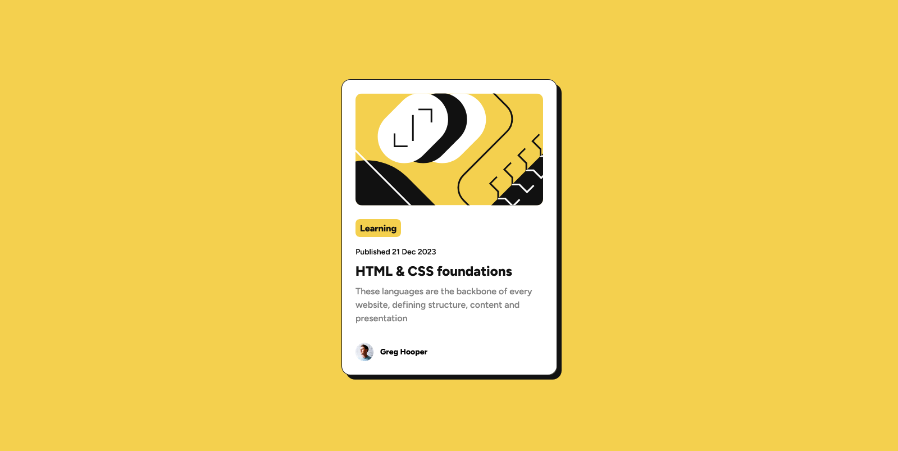

<h3 align="center">Hey You, Wassup, 👋 call me Poet</h3>

<h2 align="center">I Welcome You to my Engineering World of Design and Development.   Lets get Thrilled!👻</h2>

<h3 align="left">Empowering brands to shine in the digital realm. Let's redefine the norm and stay at the forefront. No fluff, just leading the way in innovation</h3>

<h4>The combination of my passion for design, code & interaction positions me in a unique place in the web design world.</h4>

<h2 align="center">Interested in Languages and Tools I work with?</h2>

  

  
  
  
  
  
  

  
  
  
  
  

  

<h2 align="center">I am currently engaged in:</h2>

<h3>Frontend Mentor Coding Challenges</h3>

- [Frontend Mentor](https://www.frontendmentor.io) challenges help you improve your coding skills by building realistic projects.

- Check out my Frontend Mentor Solutions at [@MomanyiPoet](https://www.frontendmentor.io/profile/MomanyiPoet)

## Thank You✨ for Stopping by! Kindly

- Visit My Website - [Momanyi Brian](https://momanyi-brian-portfolio.vercel.app) and lets fantasize something great!😊

<h3 align='center'>Bye Bye! 🎊 Don't be a Stranger!</h3>