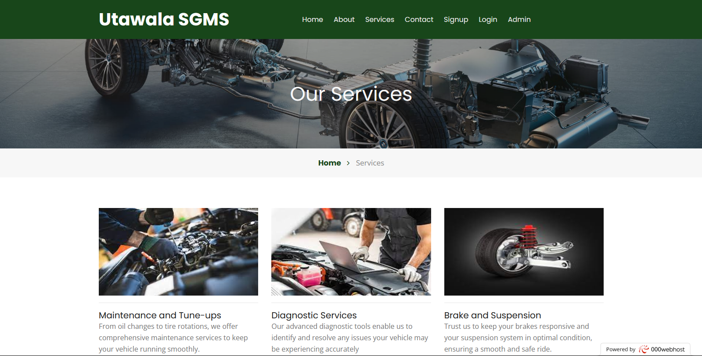
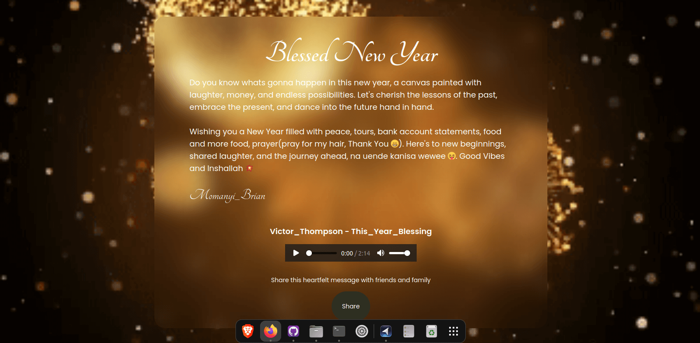

<h3 align="center">Hey You, Wassup, 👋 call me Poet</h3>

  

<h2 align="center">I Welcome You to my Engineering World of Design and Development.   Lets get Thrilled!👻</h2>

<h3 align="left">Empowering brands to shine in the digital realm. Let's redefine the norm and stay at the forefront. No fluff, just leading the way in innovation</h3>

<h4>The combination of my passion for design, code & interaction positions me in a unique place in the web design world.</h4>

<h2 align="center">Interested in Languages and Tools I work with?</h2>

  

  
  
  
  
  
  
  

  
  
  
  
  
  

  

<h2 align="center">Check Out My Cool Portfolio Projects</h2>

### [MINTY E-Commerce Website:](https://minty-body-glamour.vercel.app/)
- Built with Vite + React for the frontend using Tailwind CSS. This responsive project allows a business to showcase their products and attract clients who can then order the products via WhatsApp message.

  

#### Key Features:
- Responsive Design: Ensured a consistent user experience across all devices with Tailwind CSS.
- SEO Optimization: Applied best practices for search engine optimization to enhance visibility.
- User Experience: Focused on creating an intuitive and engaging user interface.

### [Fine Touch Salon:](https://fine-touch-salon.vercel.app/)
- Built with Vite + React for the frontend using Tailwind CSS. This responsive project aims to provide a dynamic and interactive platform for a salon business to showcase their services and attract clients through the professional website.

  

#### Key Features:
- Responsive Design: Ensured a consistent user experience across all devices with Tailwind CSS.
- SEO Optimization: Applied best practices for search engine optimization to enhance visibility.
- User Experience: Focused on creating an intuitive and engaging user interface.

### [OPENed CAREER:](https://openedcareer.com/)
- Responsive website utilizing Tailwind CSS for a sleek and modern design, integrated with WordPress backend, leveraging PHP for robust functionality and easy content management.
- It is a platform where job seekers are able to locate different career opportunites. Showcases different job roles and positions offered by companies, organisations or individuals.

  

#### Key Features:
- Responsive Design: Ensured a consistent user experience across all devices with Tailwind CSS.
- WordPress Integration: Implemented a custom WordPress backend for efficient content management.
- PHP Development: Utilized PHP to develop dynamic and interactive features.
- SEO Optimization: Applied best practices for search engine optimization to enhance visibility.
- User Experience: Focused on creating an intuitive and engaging user interface.

### [Utawala Service Garage Management System:](https://utawala-servicesgms.000webhostapp.com/index.php)

- The project mainly targets the automobile business sector (garage-sector). It is designed to attend the basic needs of a small garage, which are the daily operations and routine of the workers (mechanics), time handling and customer satisfaction.

  

#### Key Features:
- Allows customers to create accounts and sign up their particulars. It will also enable them to edit their profile details in their account.
- Provide a sign-up/login system which gives preference to only authorized personnel only. Particulars of individuals are stored in in the systems database.
- Enable new customers and existing ones to book a service or repair, at any time and from anywhere with internet access. It involves providing personal details and those of a particular vehicle.
- Maintain history of every service executed in each vehicle available for customers and administrators e.g. Complete set of the cost of service depending on the car problem e.g. the cost of changing a car tire is 700/= plus service fees 80/= bringing to a total of 780/=. The information will be available for change (such as changing the unit price) by authorized users and also provide functionalities such as printing. This will greatly enable the customer to be aware and well informed.
- Provides a set of car services with details on how to solve the set of car issues presented. In case mechanics are not familiar with a particular car issue, they are able to revise the details hence prevent further damage.
- Generate Invoice details concerning a particular customer service
- Generate report activities based on specified dates or sales report
- Print invoice details based on a specified customer or sales report

### [Poetic Inspirations:](https://poetic-inspirations.netlify.app/)

- This website is a collection of poetry resources designed to inspire and engage readers.

  

### NOTEWORTHY PROJECTS

### [Easter Website:](https://blessed-easter-holiday.vercel.app/)

- Easter Website to share warm wishes and success.

  

### [Funeral Website:](https://farewell-bosibori-nyambane.vercel.app/)

- Funeral Website to share warm wishes and condolence messages.

  

### [Valentines Website:](https://happy-valentines-website.vercel.app/)

- This is a Valentines Website to share warm wishes and love.

  

### [New Year Website:](https://new-year-ruddy.vercel.app/)

- This is a New Year's Website to share warm wishes and success

  

### [Christmas Website:](https://christmas-theta.vercel.app/)

- This is a Christmas Website to share warm wishes and success

  

<h2 align="center">I am currently engaged in:</h2>

<h3>Frontend Mentor Coding Challenges</h3>

- [Frontend Mentor](https://www.frontendmentor.io) challenges help you improve your coding skills by building realistic projects.

- Check out my Frontend Mentor Solutions at [@MomanyiPoet](https://www.frontendmentor.io/profile/MomanyiPoet)

## Thank You✨ for Stopping by! Kindly

- Visit My Website - [Momanyi Brian](https://portfolio-momanyi-brian.vercel.app) and lets fantasize something great!😊

## Useful Resources
- [Vector Logo](https://www.vectorlogo.zone/)
- [World Vector Logo](https://worldvectorlogo.com/)

<h3 align='center'>Bye Bye! 🎊 Don't be a Stranger!</h3>
